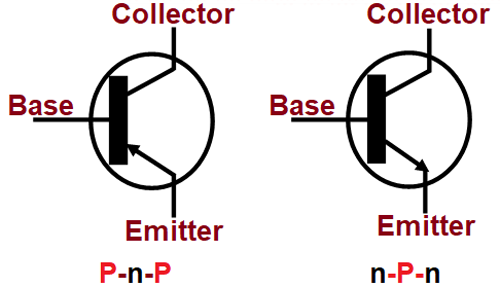
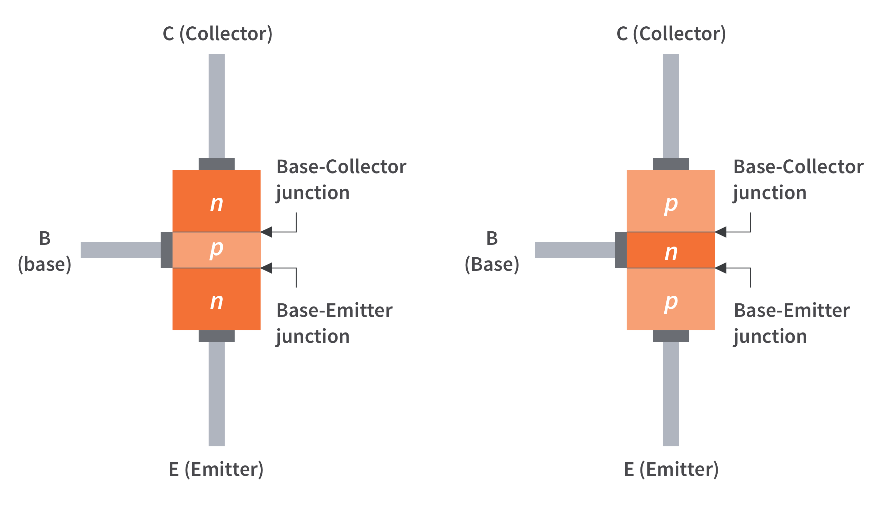

<< [HOME](/README.md)

# Estrutura básica do Transistor de Junção Bipolar(BJT)

### Diagrama elétrico

[Link origem da imagem](https://components101.com/articles/understanding-bjt-transistor-and-how-to-use-it-in-your-circuit-designs)

### Estrutura de camadas

[Link origem da imagem](https://www.circuitbread.com/tutorials/bipolar-junction-transistor-bjt-basic-structure-and-operation)

### Packages transistors encapsulamento "aspecto físico visual"

[Link origem da imagem](https://pt.wikipedia.org/wiki/Trans%C3%ADstor)

<< [HOME](/README.md)