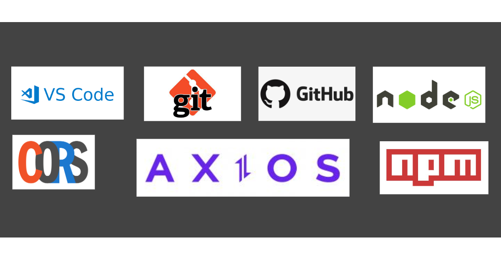
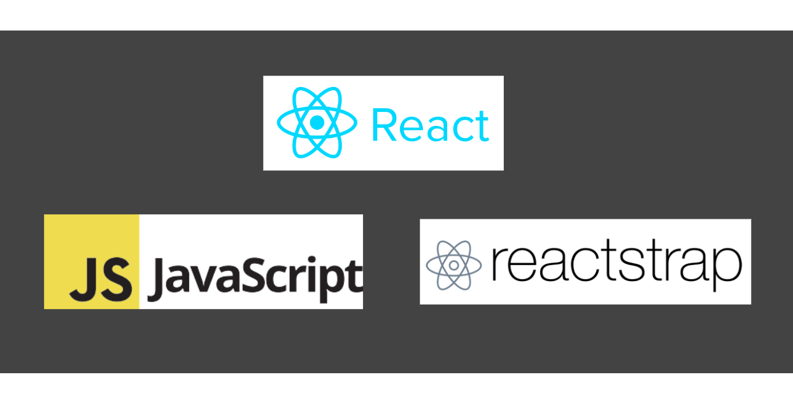

<< [HOME](/README.md)

# Ferramentas e tecnologias empregadas no desenvolvimento do sistema

1 - Visual code Studio, também chamado de VS-CODE, como ferramenta de edição de código, IDE(Integrated Development Environment), do português ambiente de desenvolvimento integrado.

2 - Git, Ferramenta de versionamento de código.

3 - Github, para gerenciar e disponibilizar o código para comunidade de desenvolvedores e eventuais colaboradores.

4 - Node como ferramenta de execução do javascrip.

5 - CORS (Cross-origin Resource Sharing) utilizado para facilitar a comunicação fazendo uso dos verbos HTTP entre as diferentes origens, neste caso entre o Front-End e Back-End da Aplicação.

6 - Axios, é um cliente HTTP baseado em Promise Javascript.

7 - NPM, gerenciador de pacotes que já vem embutido no Nodejs.

8 - Javascript, como linguagem de programação.

9 - React, biblioteca  para construir a interface de usuário baseada em componentes.

10 - Reactstrap, como biblioteca que oferece componentes "prontos" para facilitar o desenvolvimento de templates.
