<< [HOME](/README.md)

### instale as ferramentas e dependências

1 - Caso não tenha, instale um editor de código de sua preferência
Para o desenvolvimento deste projeto foi utilizado o visual Studio Code também chamado de VS-Code, caso deseje instalá-lo em sua máquina clique no link a seguir para ser redirecionado(a) para a página oficial do Visual Studio Code.

[Link - Download Visual Studio](https://code.visualstudio.com/)

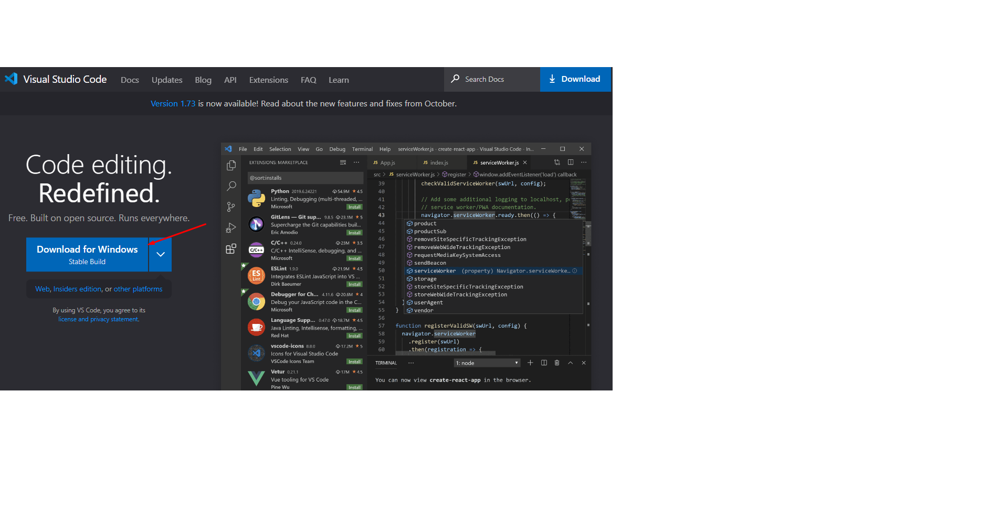

2 - Após fazer o download, vá até a pasta em que foi salvo o VS-Code Baixado e clique no arquivo executável para iniciar a instalação, a instalação é bastante simples, basicamente NEXT, NEXT..., FINISH. 

3 - Após ter feito a instalação do editor de código VS-Code, instale também o Node.Js, acessando a página a página oficial do Node.Js, clique no link a seguir.

Obs: recomendável utilizar sempre a versão LTS, que é a versão mais estável

[Link - Download do Node.Js](https://nodejs.org/en/)

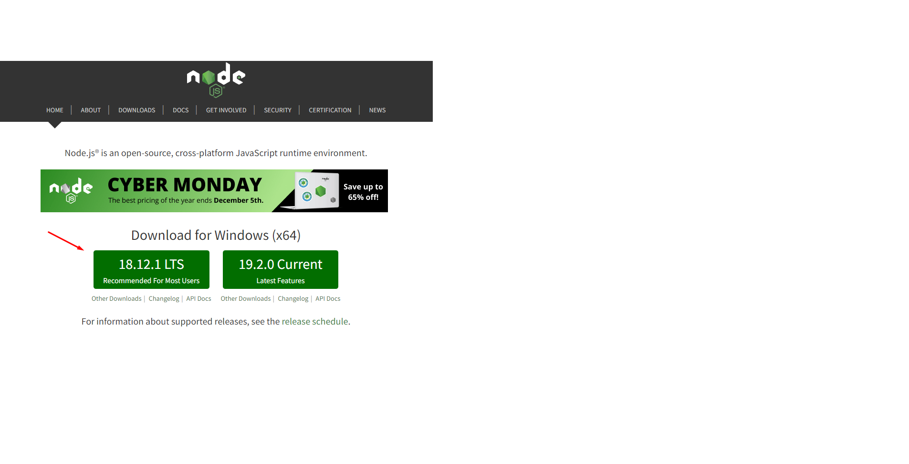

4 - Após fazer o download, será basicamente da mesma forma como foi feito na instalação o VS-Code, indo até a pasta do download, clicando no arquivo executável, aceitando as recomendações padrão, basicamente NEXT, NEXT... FINISH. 

5 - Para que você possa rodar a aplicação, desenvolver e ter um controle de versão, tenha instalado o Git em sua máquina.
Para instalar o Git é bastante simples, acesse a página oficial do Git através do link a seguir.

[Link - Download do Git](https://git-scm.com/)

Assim como o VS-Code e o NodeJs  o Git identifica o Sistema Operacional que está rodando na máquina, após acessar o link e entrar na página do Git, basta apenas clicar no botão para download conforme ilustra a imagem acima.

6 - Acesse a pasta onde foi feito o download do Git, acesse o instalador e de um clique duplo, permita que o aplicativo faça as alterações necessárias em sua máquina, leia e aceite a licença clicando em next, aceite as recomendações clicando sempre em next e por final Install. 

7 - Agora que temos algumas ferramentas instaladas na máquina, já podemos baixar ou clonar a aplicação, ou fazer um Fork da aplicação para sua conta no Github, assim o clone pode ser feito a partir da sua conta no Github e assim fazer suas alterações e enviar para seu próprio github.

7.1 Para clonar a aplicação entre na pasta onde você deseja clonar a aplicação, como exemplo foi criada uma pasta chamada clone_app_GST dentro do diretório de downloads, crie a sua no local desejado, como por exemplo em documentos ou mesmo em downloads, também nomeie a pasta como quiser.

Copie a URL da aplicação no GitHub conforme ilustra a imagem a seguir, caso tenha feito o fork, o link será referente ao projeto, porém da sua conta git hub.
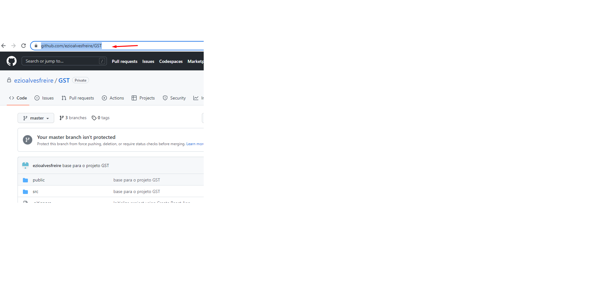

Caso tenha instalado o Git em sua máquina, pode-se usar o GitBash para clonar a aplicação GST
para isso entre na pasta que foi criada e clique com o botão auxiliar do mouse, será aberta uma janela, clique em Git Bash Here, conforme ilustra a imagem abaixo. 

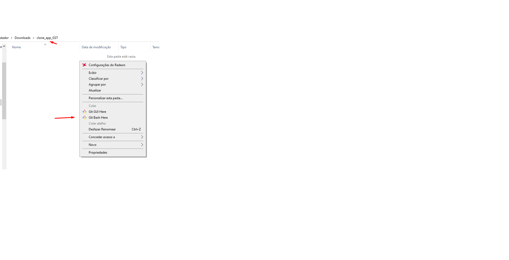

Será aberto um terminal Bash, conforme ilustra imagem abaixo.
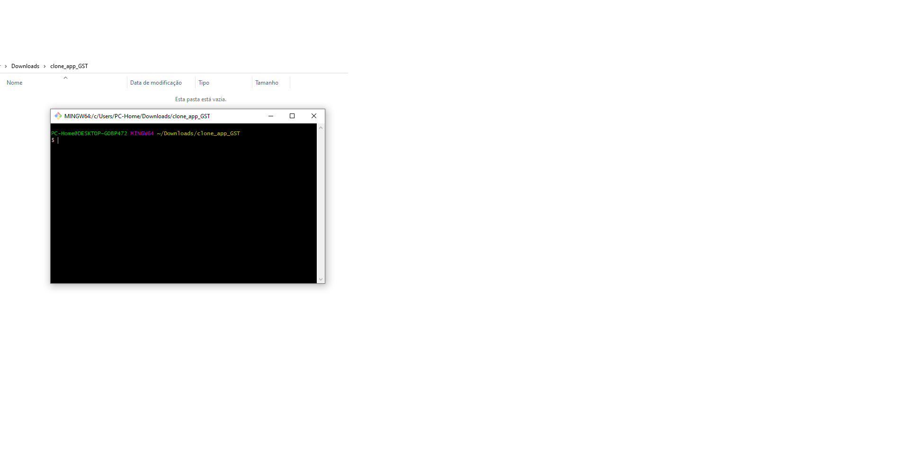

após ter copiado o link da URL do projeto e aberto o terminal, dê o comado git clone e cole a URL do projeto clicando com botão auxiliar do mouse e clicando em paste
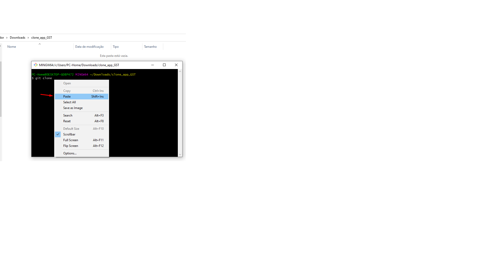

Veja na imagem abaixo como ficou o comando git clone  + URL da aplicação
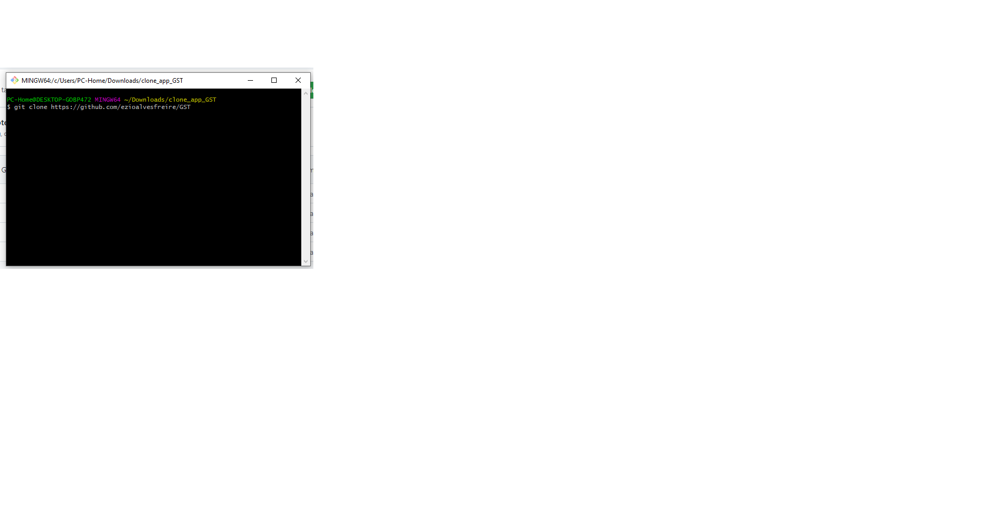

Em alguns segundos será feito o clone da aplicação

Download Ok
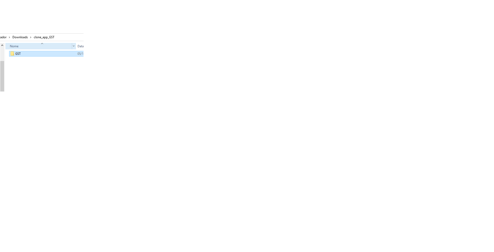

Dê um clique duplo e entre na pasta do projeto
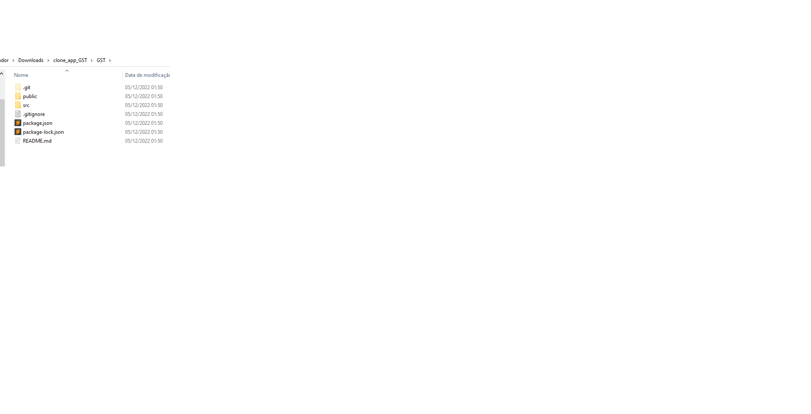

Para acessar o projeto utilizando o VS_Code, utilize o atalho digitando no termial o comando "code ." e tecle enter, se o seu visual Code estiver configurado para abrir através deste comando que já vem configurado por padrão o projeto será aberto.

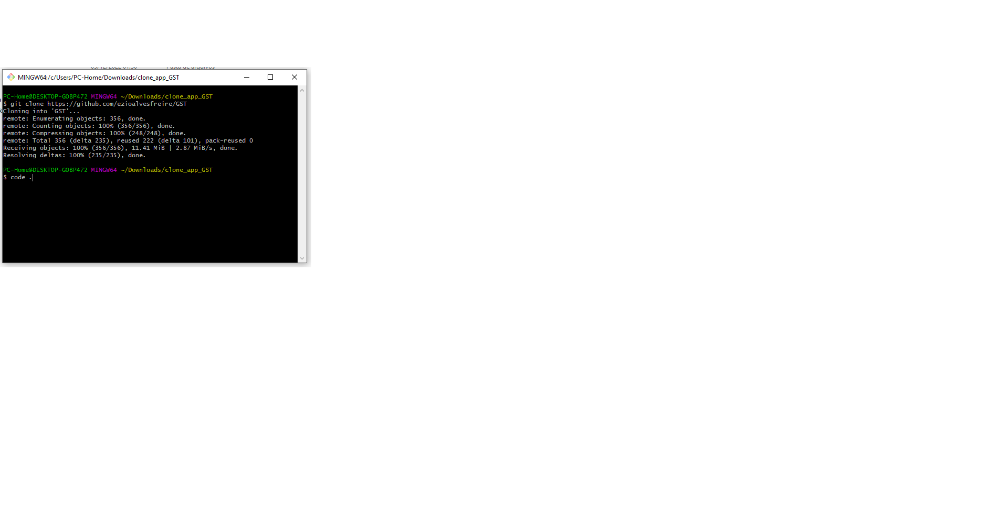

Para termos uma abrangencia maior no uso de ferramentas e também maior comodidade, a partir deste momento os comandos no terminal será dado a partir do terminal de comando contido no VS-Code, fique a vontade para utilizar qualquer outro terminal.

Conforme ilustra a imagem abaixo, clique em Terminal no parte superio do VS_Code, na nova janela aberte clique em Novo Terminal ou utilize as teclas de atalho, Ctrl + Shift + ' será aberto um terminal na parte inferior do VS-Code.

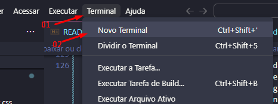

7 - Com terminal aberto podemos inclusive consultar se o Node.Js foi instalado corretamente e qual sua versão para isso dê o comando node -v ou node --version.
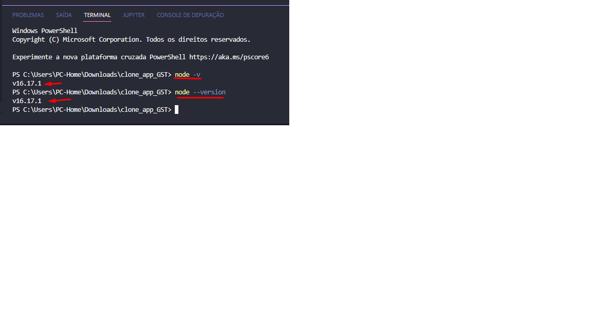

 Já que temos o Node.Js foi instalado na máquina, podemos utilizar NPM (Node Package Mananger) gerenciador de pacotes que já vem com Node.js para gerenciar nossas dependências, o Yarn é uma boa alternativa ao NPM, mas essa documentação seguirá com NPN.

8 - Antes navegue até a pasta do projeto, pode ser utilizado o comando cd GST.

9 - O projeto que GST que foi clonado encontra-se na Branch master, "branch é um ramo de versionamento do Git", atualmente as ultimas implementações do projeto encontra-se na branch newDev.

10 - para verificar sua branch atual dê o comando "git branch".

11 - Para mudar para branch newDev, basta dar o comado git checkout newDev.

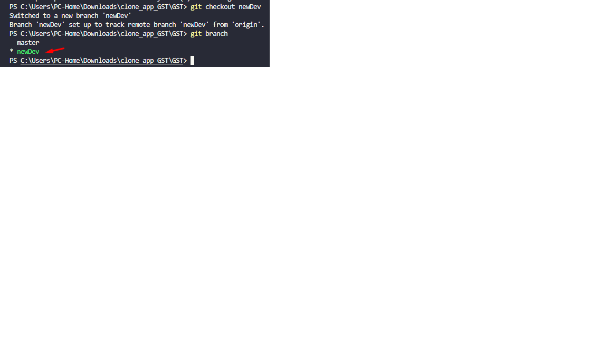

12 - Instale as dependências utilizando o comando npm install,
com isso o Node Package mananger irá consultar o arquivo package.json verificando quais dependências necessárias a ser  instaladas.

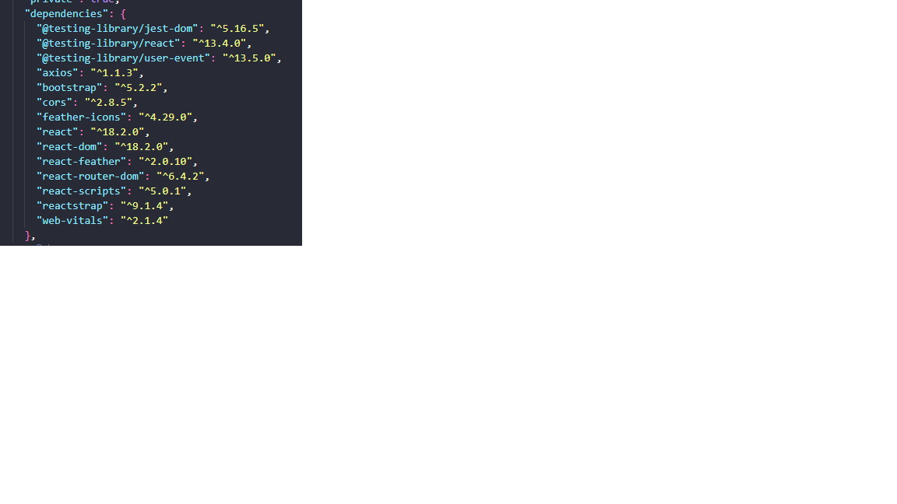

Veja na imagem abaixo que os pacotes foram adicionados 1462 pacotes e auditado 1463.
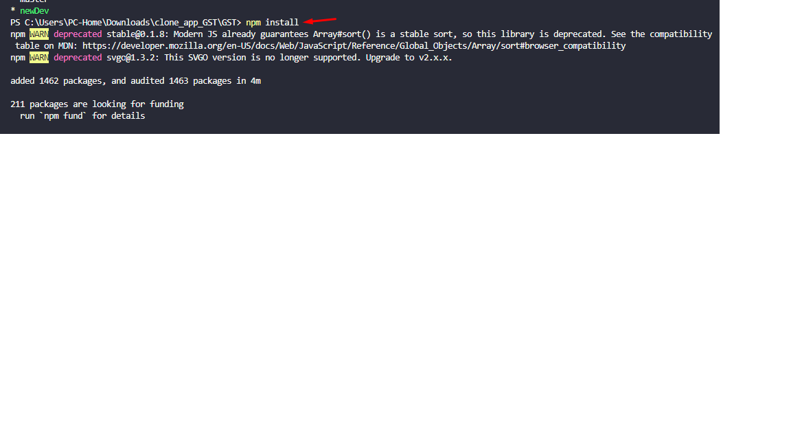

13 - suba a aplicação através do comando npm start
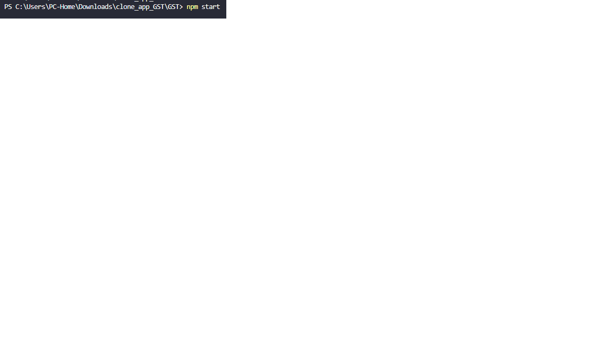

A aplicação pode ser visualizada acessando no navegador a URL localhost:3000

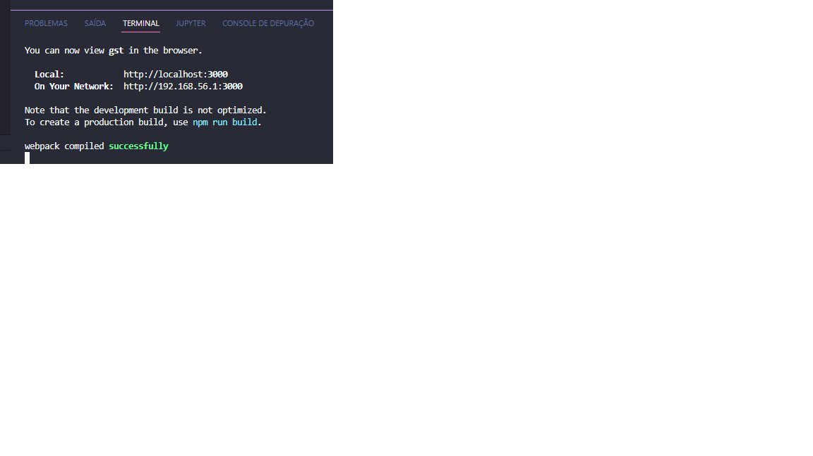

<< [HOME](/README.md)
