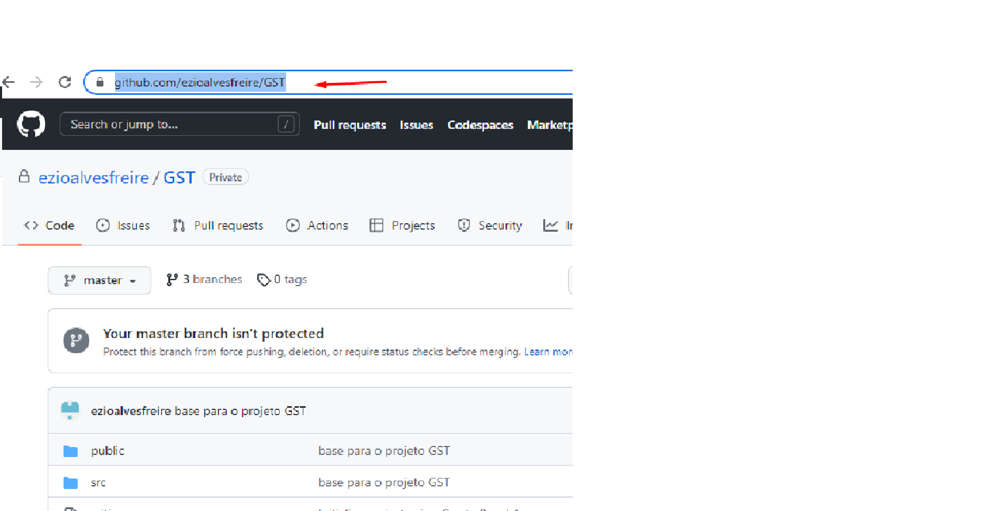

<< [HOME](/README.md)

1 - Para clonar a aplicação entre na pasta onde você deseja clonar a aplicação, como exemplo foi criada uma pasta chamada clone_app_GST dentro do diretório de downloads, crie a sua no local desejado, como por exemplo em documentos ou mesmo em downloads, também nomeie a pasta como quiser.

2 - Copie a URL da aplicação no GitHub conforme ilustra a imagem a seguir, caso tenha feito o fork, o link será referente ao projeto, porém da sua conta git hub.

3 - Caso tenha instalado o Git em sua máquina, pode-se usar o GitBash para clonar a aplicação GST
para isso entre na pasta que foi criada e clique com o botão auxiliar do mouse, será aberta uma janela, clique em Git Bash Here, conforme ilustra a imagem abaixo.

Será aberto um terminal Bash, conforme ilustra imagem abaixo.

4 - após ter copiado o link da URL do projeto e aberto o terminal, dê o comado git clone e cole a URL do projeto clicando com botão auxiliar do mouse e clicando em paste

Veja na imagem abaixo como ficou o comando git clone + URL da aplicação

Em alguns segundos será feito o clone da aplicação

4 - Feito o download, descompacte o arquivo  

5 - Entre na pasta do projeto

6 - Para acessar o projeto utilizando o VS_Code, utilize o atalho digitando no termial o comando "code ." e tecle enter, se o seu visual Code estiver configurado para abrir através deste comando que já vem configurado por padrão o projeto será aberto.

Para termos uma abrangencia maior no uso de ferramentas e também maior comodidade, a partir deste momento os comandos no terminal será dado a partir do terminal de comando contido no VS-Code, fique a vontade para utilizar qualquer outro terminal.

7 - Conforme ilustra a imagem abaixo, clique em Terminal no parte superio do VS_Code, na nova janela aberte clique em Novo Terminal ou utilize as teclas de atalho, Ctrl + Shift + ' será aberto um terminal na parte inferior do VS-Code.

8 - Com terminal aberto podemos inclusive consultar se o Node.Js foi instalado corretamente e qual sua versão para isso dê o comando node -v ou node --version.

Já que temos o Node.Js foi instalado na máquina, podemos utilizar NPM (Node Package Mananger) gerenciador de pacotes que já vem com Node.js para gerenciar nossas dependências, o Yarn é uma boa alternativa ao NPM, mas essa documentação seguirá com NPN.

9 - Antes navegue até a pasta do projeto, pode ser utilizado o comando cd GST.

10 - O projeto que GST que foi clonado encontra-se na Branch master, "branch é um ramo de versionamento do Git", atualmente as ultimas implementações do projeto encontra-se na branch newDev.

11 - para verificar sua branch atual dê o comando "git branch".

12 - Para mudar para branch newDev, basta dar o comado git checkout newDev.

13 - Instale as dependências utilizando o comando npm install,
com isso o Node Package mananger irá consultar o arquivo package.json verificando quais dependências necessárias a ser instaladas.

Veja na imagem abaixo que os pacotes foram adicionados 1462 pacotes e auditado 1463.

14 - suba a aplicação através do comando npm start

A aplicação pode ser visualizada acessando no navegador a URL localhost:3000

<< [HOME](/README.md)
