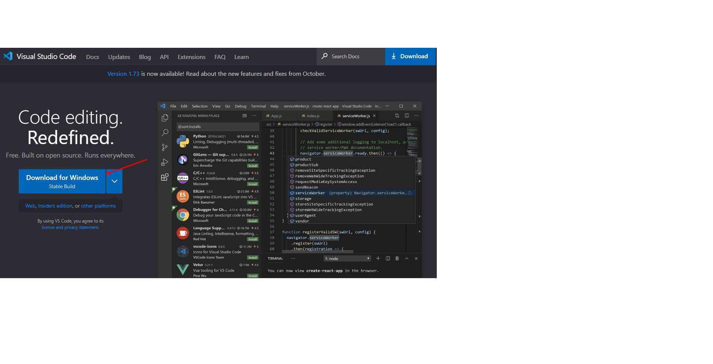
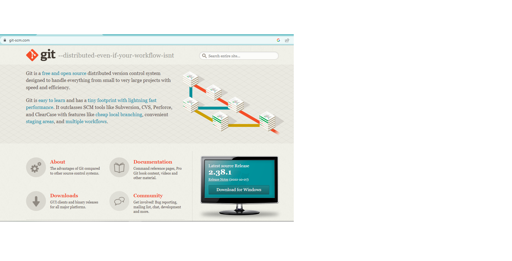

<< [HOME](/README.md)

Preparação do ambiente para rodar a aplicação, instale as ferramentas e dependências necessárias

1 - Caso não tenha, instale um editor de código de sua preferência
Para o desenvolvimento deste projeto foi utilizado o visual Studio Code também chamado de VS-Code, caso deseje instalá-lo em sua máquina clique no link a seguir para ser redirecionado(a) para a página oficial do Visual Studio Code.

[Link - Download Visual Studio](https://code.visualstudio.com/)

2 - Após fazer o download, vá até a pasta em que foi salvo o VS-Code Baixado e clique no arquivo executável para iniciar a instalação, a instalação é bastante simples, basicamente NEXT, NEXT..., FINISH. 

3 - Após ter feito a instalação do editor de código VS-Code, instale também o Node.Js, acessando a página a página oficial do Node.Js, clique no link a seguir.

Obs: recomendável utilizar sempre a versão LTS, que é a versão mais estável

[Link - Download do Node.Js](https://nodejs.org/en/)

4 - Após fazer o download, será basicamente da mesma forma como foi feito na instalação o VS-Code, indo até a pasta do download, clicando no arquivo executável, aceitando as recomendações padrão, basicamente NEXT, NEXT... FINISH. 

5 - Para que você possa rodar a aplicação, desenvolver e ter um controle de versão, tenha instalado o Git em sua máquina.
Para instalar o Git é bastante simples, acesse a página oficial do Git através do link a seguir.

[Link - Download do Git](https://git-scm.com/)

Assim como o VS-Code e o NodeJs  o Git identifica o Sistema Operacional que está rodando na máquina, após acessar o link e entrar na página do Git, basta apenas clicar no botão para download conforme ilustra a imagem acima.

6 - Acesse a pasta onde foi feito o download do Git, acesse o instalador e de um clique duplo, permita que o aplicativo faça as alterações necessárias em sua máquina, leia e aceite a licença clicando em next, aceite as recomendações clicando sempre em next e por final Install.

7 - Agora que temos algumas ferramentas instaladas na máquina, já podemos baixar ou clonar a aplicação, ou fazer um Fork da aplicação para sua conta no Github, assim o clone pode ser feito a partir da sua conta no Github e assim fazer suas alterações e enviar para seu próprio github.