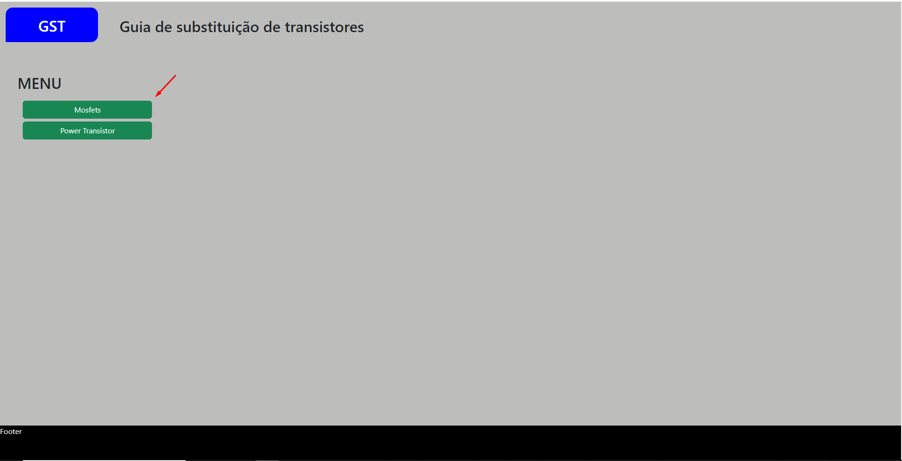
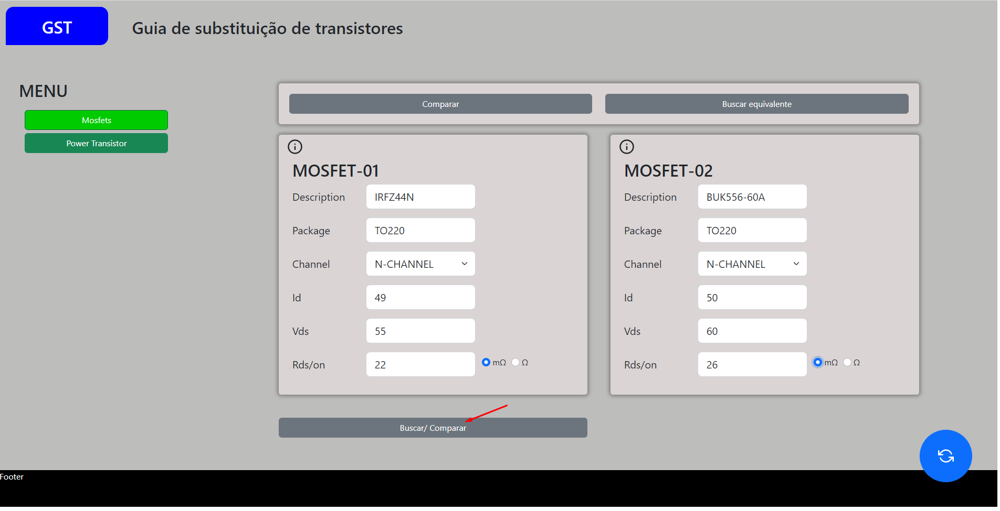
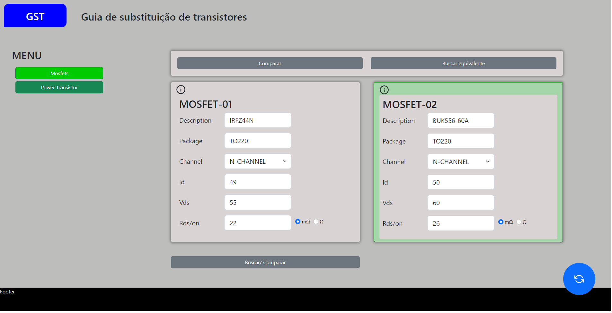
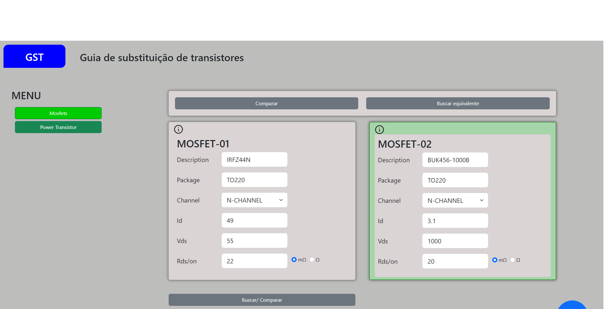
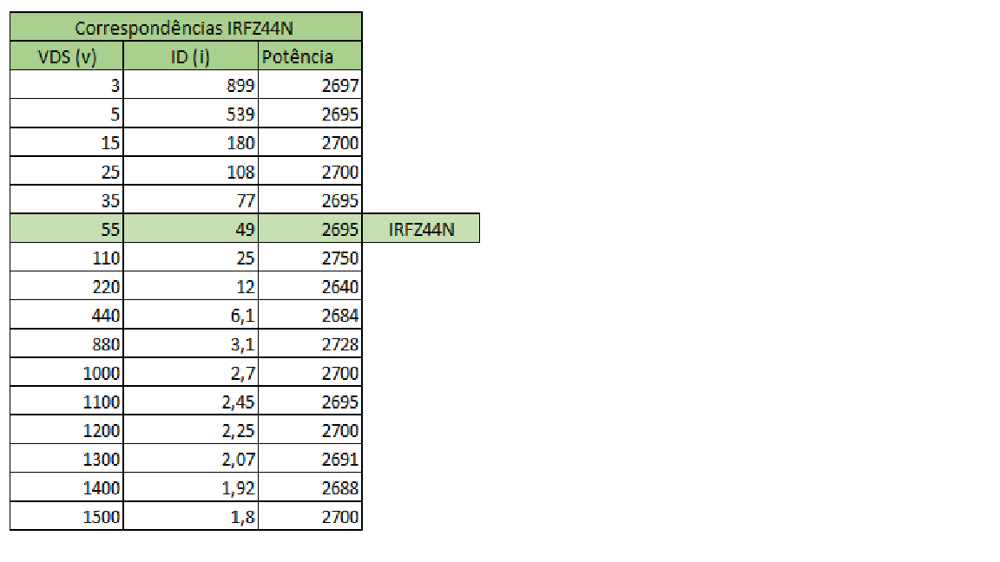
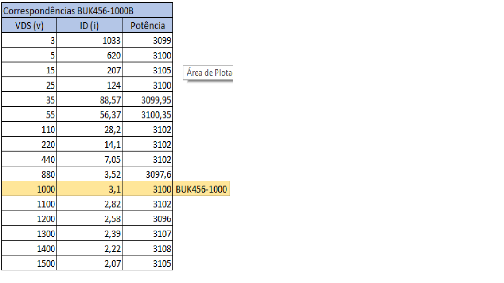
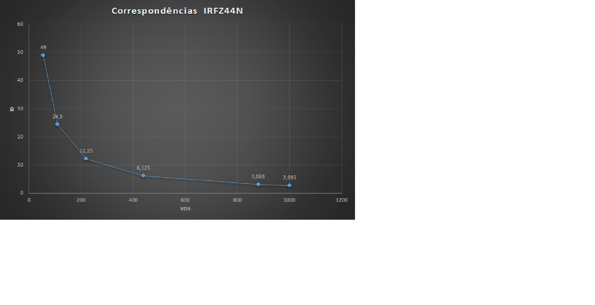
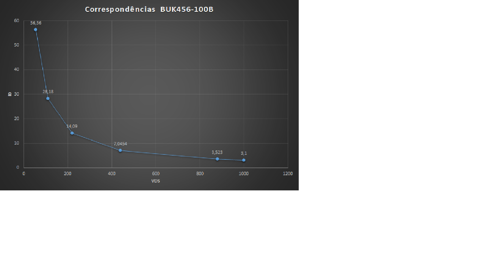

<< [HOME](/README.md)

## Página inicial do App

## Selecione uma opção Ex: Mosfet

## Datasheet INFZ44N e BUK556-60
datasheet_buk556

datasheet_irfz44n

## Preencha os dados conforme o Datasheet
em seguida clique no botão Buscar/comparar

## Resultado da Comparação

Neste exemplo o sistema GST reportou, equivalente, ficando verde o fundo do formulário.

Faremos agora novo comparativo utilizando IRFZ44N desta vez com BUK456-1000B

datasheet_buk456

## Preencha os dados conforme o Datasheet

## Note o resultado da comparação

Neste exemplo o sistema GST reportou, não equivalente, ficando vermelho o fundo do formulário e também o campo onde esbarrou em restrição RDS/on, se houvesse outras restrições os respectivos campos também ficariam com borda vermelha.

## Situação hipotética para o sistema GST declare como substituto IRFZ44N pelo BUK45-1000B

Para efeito de teste, será modificado o campo RDS/on de 5 Ohms para 20 m/ohms 

Note que o fundo do formulário ficou verde, o que sginifica componente equivalente

##  Porque desconsiderando o RDS/on o BUK456-1000 é compatível com IRFZ44N se possuem valores VDS e ID tão adversos.

Para que se possa entender a equivalência de um componente é preciso se ter uma ideia do comportamento da eletricidade estudado pelo ramo da Física denominado Física Eletrodinâmica. 

Para  saber o quanto um componente é capaz de suportar em termos de eletricidade e temperatura basta consultar seu datasheet.

Observação 1: Sempre que estiver sendo citado, Tensão, ddp(Diferença de potencial), volts ou "voltagem", estaremos falando da mesma coisa, e seu valor é dado em V ou U.

Observação 2: Sempre que estiver sendo citado Intensidade da corrente elétrica ou "Amperagem" dada em amper, estaremos falando da mesma coisa e seu valor é dado em I ou A

Para encontrar um transistor equivalente, dentre outros atributos é preciso encontrar a potência do transistor.

para encontrar a potência do transistor basta aplicar a fórmula da primeira lei de Joule, potência é igual ao produto Intensidade da corrente  pela tensão,  P = I * U.

[Saiba mais sobre a lei de Joule](https://pt.wikipedia.org/wiki/Lei_de_Joule)

Um transistor possui basicamente 3 pinos, mosfet possui os pinos denominados, gate, drain, source.

VDS - quando estamos falando de VDS, estamos falando sobre a tensão (v) que o transistor é capaz de suportar entre os pontos "A" e "B", sendo entre o pino dreno ao pino source, portanto VDS(Voltage Drain Source).

obs: o transistor é capaz de suportar tensões muito maiores que o especificado no datasheet desde que a intensidade da corrente a ser aplicada seja muito menores, pois sua potência é constante, sempre que houver qualquer dúvida, aplique a primeira lei de ohm.

Obs: O aplicativo GST na versão 1.0 está aceitando uma margem de erro de até 30% para mais ou para menos.

Qual o problema de se aceitar uma margem maior, muito elevada? tecnicamente em alguns casos pode mudar o propósito do transistor, a exemplo em transistor Power transistor criado para trabalhar com alta frequência geralmente são com baixa potência como por exemplo o BF199 muito utilizado em rádios e transmissores, não seria interessante colocar um transistor de alta potência mesmo que com mesmo encapsulamento, isso poderia comprometer o ganho de recepção de sinal ou de transmissão desconsiderando as posições dos pinos teria como exemplo o transistor BF199 vs BF422, outro fator é que quando se aceita valores muito maiores tende a aumentar o preço especialmente quando muda o encapsulamento, outro problema de mudar o encapsulamento é que pode ser que não haja espaço suficiente para o novo componente ou que se tenha que aumentar o furo na placa para passagem dos pinos do novo componente.  

### Qual o problema de se aceitar margem muito menor
O problema de se aceitar margem muito menor pode ser que seja recomendado um transistor como potência abaixo do esperado e trabalhe aquecendo bastante e até acabe queimando. 

A versão em desenvolvimento da aplicação GST poderá estar recomendando transistores com potência de até 30% inferior ao modelo original e até 30% superior

## Veja a seguir tabelas e gráficos para que isso seja demonstrado de forma mais visual. 

Obs: a potência é sempre constante, porém as tabelas abaixo apresentam pequenas variações devido a necessidade de se obter menor número de casas decimais para que o gráfico não fique com muitos números após a vírgula.

Para RDS/on basta apenas verificar se é menor ou igual ou maior ao valor do transistor original do aparelho a ser substituído dentro do limite pré estabelecido, para versão 1.0 da aplicação GST está sendo aceita uma margem de erro de até 30% para mais ou para menos.

<< [HOME](/README.md)