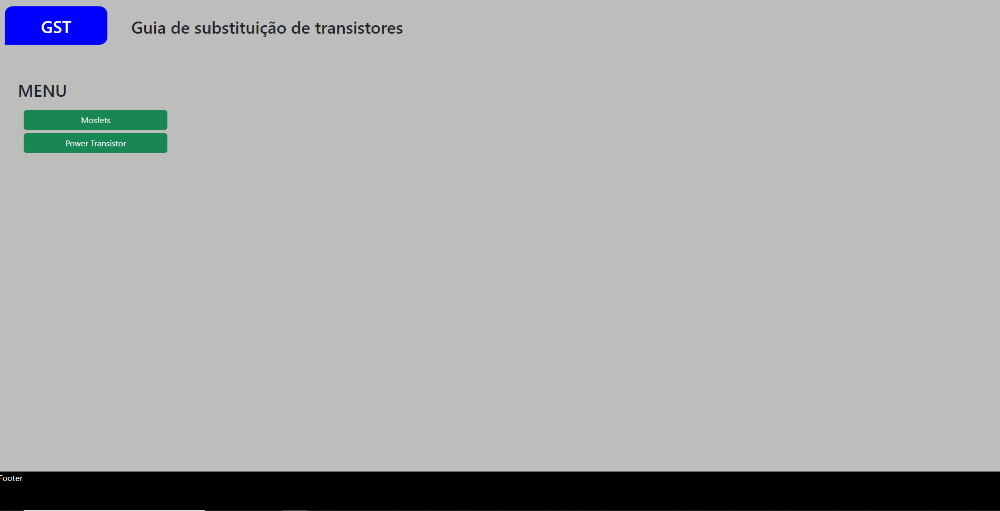
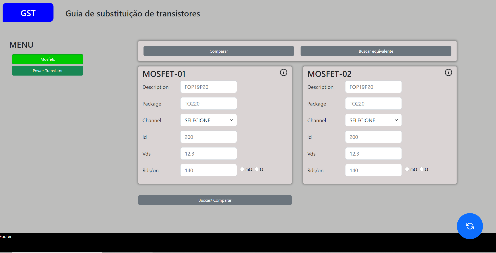
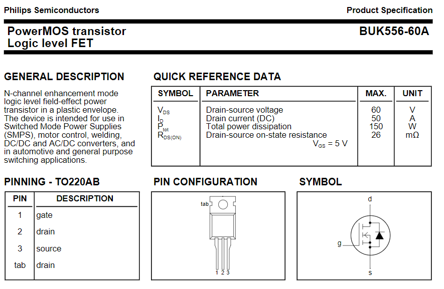
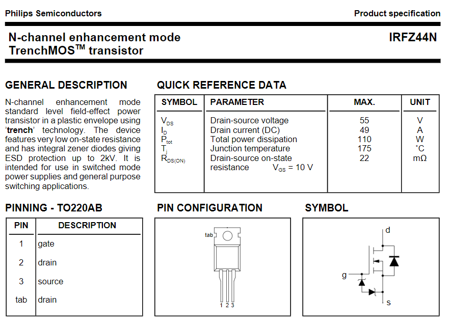
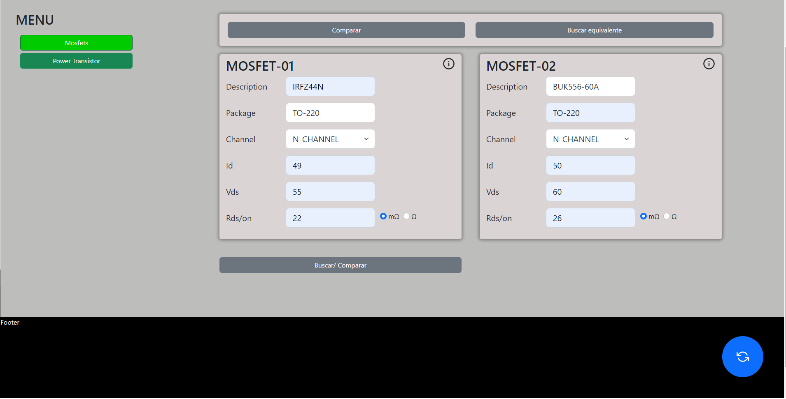
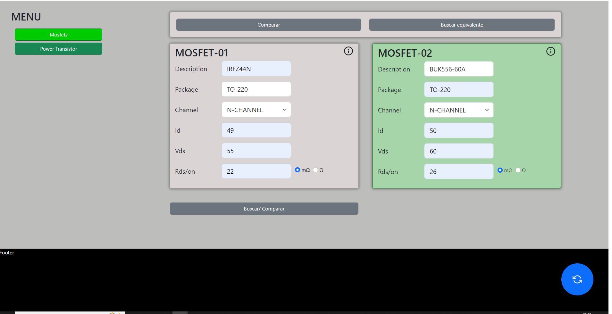
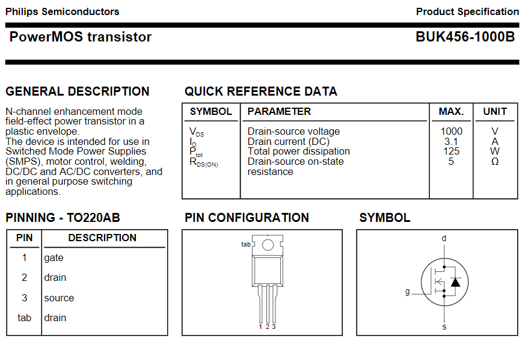
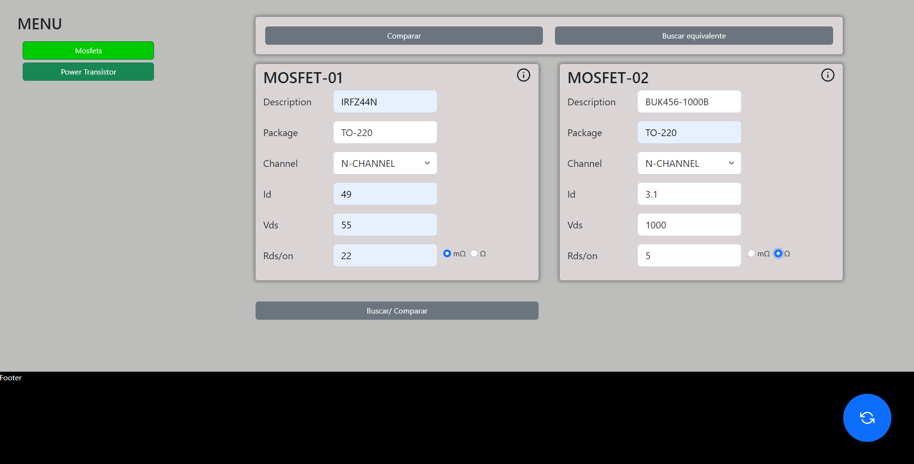

<< [HOME](/README.md)

## Página inicial do App

## Selecione uma opção Ex: Mosfet

## Datasheet INFZ44N e BUK556-60
datasheet_buk556

datasheet_irfz44n

## Preencha os dados conforme o Datasheet

## Clique em buscar/comparar

Neste exemplo sistema GST reportou, equivalente.

veja novo exemplo a seguir em que o componente não é equivalente

## Preencha os dados conforme o Datasheet

datasheet_buk456

## Clique em buscar/comparar

Neste exemplo esbarrou na restrição, RDS/on.

## justificando o porque de não ser compatível e ter esbarrado apenas no RDS/on

Antes de qualquer coisa é preciso saber como é feito o cálculo de potência

<< [HOME](/README.md)